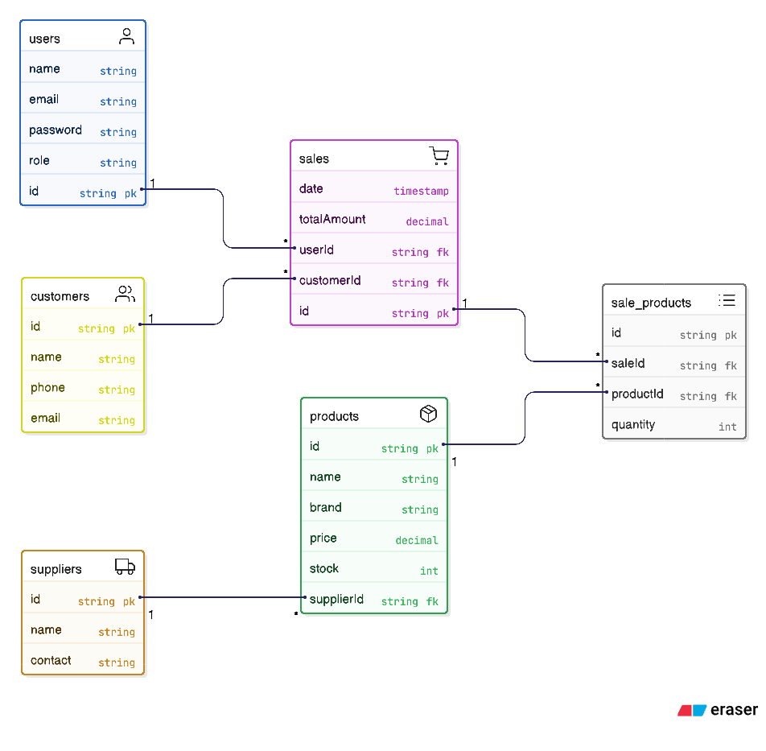

```md
# Class Diagram

```mermaid
classDiagram

class User {
  +id
  +name
  +email
  +password
  +role
  +login()
}

class Product {
  +id
  +name
  +brand
  +price
  +stock
  +updateStock()
}

class Customer {
  +id
  +name
  +phone
  +email
}

class Supplier {
  +id
  +name
  +contact
}

class Sale {
  +id
  +date
  +totalAmount
  +generateInvoice()
}

User "1" --> "*" Sale
Sale "*" --> "*" Product
Sale "1" --> "1" Customer
Supplier "1" --> "*" Product
